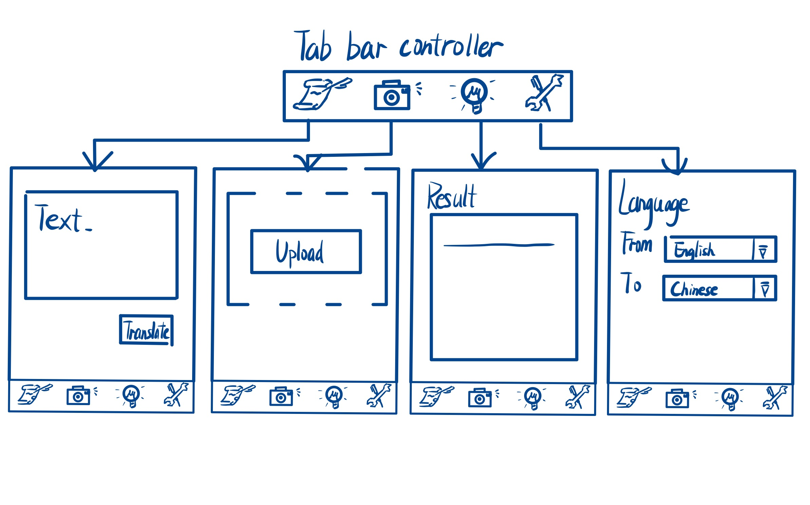

Unit 7: Capstone #3
===

# Translation

## Table of Contents
1. [Overview](#Overview)
1. [Product Spec](#Product-Spec)
1. [Wireframes](#Wireframes)
2. [Schema](#Schema)

## Overview
### Description
Record or recognize the text in the pictures uploaded by users, and convert the text content into the corresponding target language. Can be used as a translation application.
### App Evaluation
- **Category:** Translation Utility App
- **Mobile:** This app is developed primarily for mobile.
- **Story:** Receives input from the user in a source language and outputs its translation in a target language.
- **Market:** The audience of this app is open to all.
- **Habit:** This app can be used as frequently as the user needs, depedning on their translation needs.
- **Scope:** We would first translate user's recorded speech into the target language, then we could evolve to using user uploaded media such as audio recordings or videos and translate them.

## Product Spec

### 1. User Stories (Required and Optional)

**Required Must-have Stories**

* User can record speech in a source language and translate it to a target language in real time
* User can use the app as a regular translating app

**Optional Nice-to-have Stories**

* After translating, users can play the text outloud
* User can upload audio recording in a source language and translate it to a target language in real time
* User can upload photo with text in a source language and translate it to a target language in real time
* User can take a photo in real time with text in a source language and translate it to a target language in real time
* User can upload video and translate the audio from the video
* Dark-mode, light-mode feature.

### 2. Screen Archetypes

* Text translation screen
   * Allow users to enter the text they want translated, or the user can enter a recorded speech
* Picture upload screen
   * Allows users to upload pictures or videos that contain text content that users need to translate
* Translation result screen
   * Users can see the translation results of their uploaded text or images
* Setting screen
   * Allows the user to set the language to be translated and the target language

### 3. Navigation

**Tab Navigation** (Tab to Screen)

* Text/Speech Translation Tab
* Photo Translation Tab
* Video/Audio Recording Translation Tab

**Flow Navigation** (Screen to Screen)

* Text Selection -> Jumps to Text translation screen
* Picture Selection -> Jumps to Picture upload screen
* Result Selection -> Jumps to Translation result screen
* Setting -> Select translate languages

## Wireframes
[Add picture of your hand sketched wireframes in this section]

### [BONUS] Digital Wireframes & Mockups

### [BONUS] Interactive Prototype

## Schema 
[This section will be completed in Unit 9]
### Models
[Add table of models]
### Networking
- [Add list of network requests by screen ]
- [Create basic snippets for each Parse network request]
- [OPTIONAL: List endpoints if using existing API such as Yelp]
